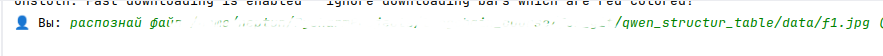
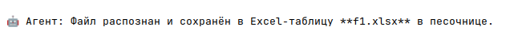
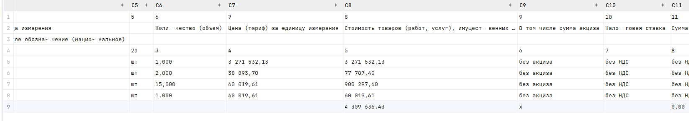
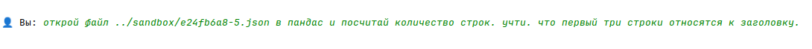
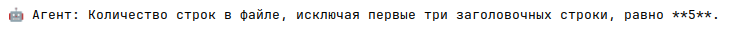
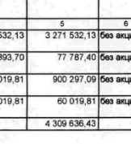

# Агент для Распознавания Счетов-Фактур

---

## 📌 Описание

Тема агентов становится всё более популярной. В данной работе реализовано расширение функционала простого чат-бота с помощью специализированного агента на основе модели **Qwen3-2B**. Этот агент умеет анализировать изображения счетов-фактур и извлекать из них табличные данные.

Извлечённые данные можно использовать для дальнейшего анализа или сохранения в Excel.

---

## 🔧 Как это работает?

### Обучение агента

- За основу взята модель **Qwen3-2B**, способная обрабатывать изображения.
- Модель была дообучена на **1000 сканов** счетов-фактур, где заранее размечены:
  - Таблицы
  - Строки и колонки
  - Текст ячеек
- Обучение проходило около **25 минут** на видеокарте RTX 5070 Ti.
- Самый трудоёмкий этап — ручная разметка документов.

### Интеграция с чат-ботом

Агент подключён как инструмент к основной LLM **OpenAI/GPT-OSS-20B**, используемой в чат-боте. Это позволяет пользователю запрашивать распознавание документов прямо через чат.

---

## 🖼 Примеры работы

1. **Запрос пользователя:**
   > "Распознай документ и сохрани в Excel"

2. **Процесс обработки (пример):**

   

3. **Ответ системы через ~1 минуту:**

   

4. **Результат в Excel:**

   

---

## ✅ Результаты

- Документ, которого не было в обучающей выборке, был успешно распознан.
- Несмотря на некоторые ошибки в распознавании текста (не являлось целью), структура таблицы определена верно.
- Возможно подключение других агентов для анализа содержимого файла.

### Пример вопроса по данным:

> "Сколько строк в документе?"

  

✅ Ответ корректен (если итог тоже считить за строку).

